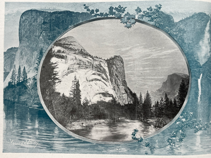

title: "Publication de Carolin Görgen - Article de revue"
---

## Type de publication:
Article dans une revue nationale

## Détails de la publication
Carolin Görgen, « Californie à Paris: Photographic Circulation and the Making of Imperial Identities, c. 1900 », _Transatlantica_, 2024, 2.

Disponible en ligne: http://journals.openedition.org/transatlantica/24151
