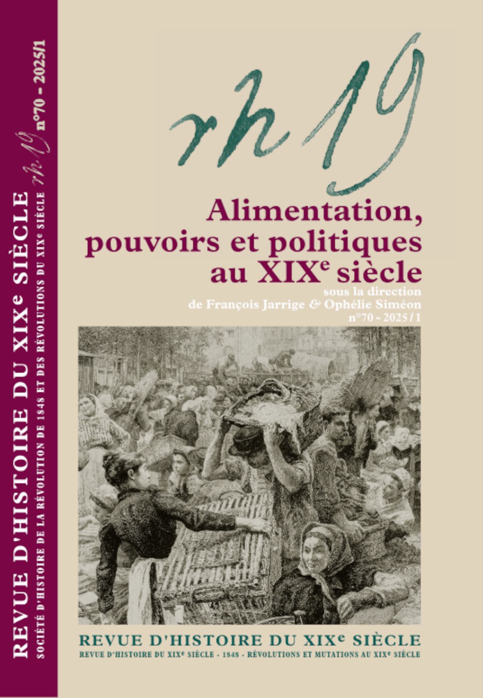

## Type de publication:
Article dans une revue nationale

## Détails de la publication
Arnaud Page. "La mesure de la faim : les enquêtes nutritionnelles d’Edward Smith (Grande-Bretagne, années 1860)". _Revue d’histoire du XIXe siècle_, 2025, 70, pp. 79-95.

Disponible en ligne: https://journals.openedition.org/rh19/10197
