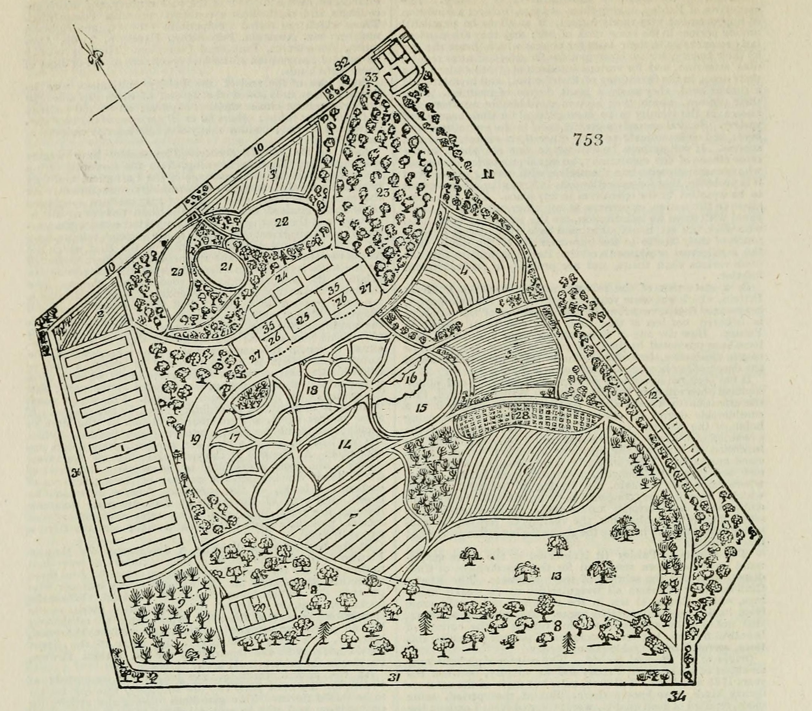

## Type de publication:
Article dans une revue internationale

## Détails de la publication
Mélanie Cournil. "Science ‘subservient to profit’? William Jackson Hooker and the first Glasgow Botanic Gardens (1817–1841)". B_ritish Journal for the History of Science_, 2025, 58 (1), pp. 39-59.

Disponible en ligne: https://journals.openedition.org/rh19/10197

