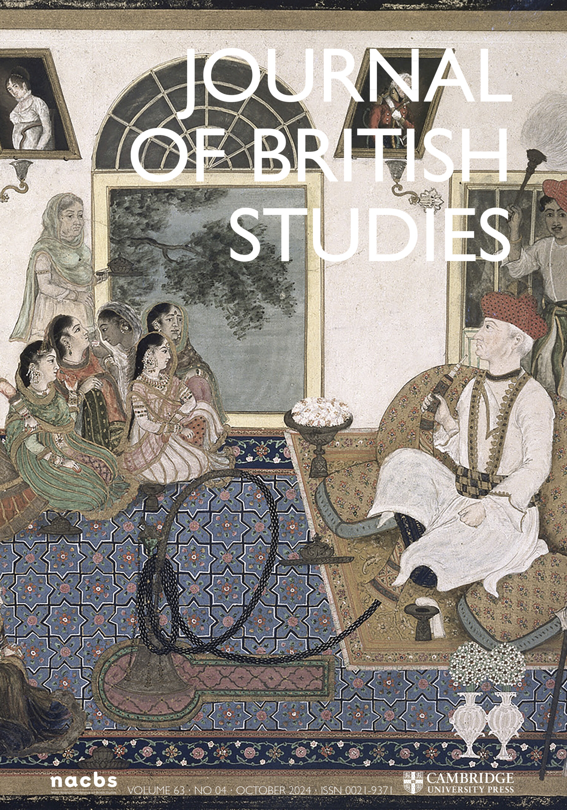

Arnaud Page. “A Bold Experiment in the Technique of Administration”: Nutrition Science and Development in the Gambia, 1946–50. *Journal of British Studies*, 2025, 64 (e16), pp.1-22.

Disponible en ligne: https://dx.doi.org/10.1017/jbr.2025.32

## Type de publication:
Article dans une revue internationale

