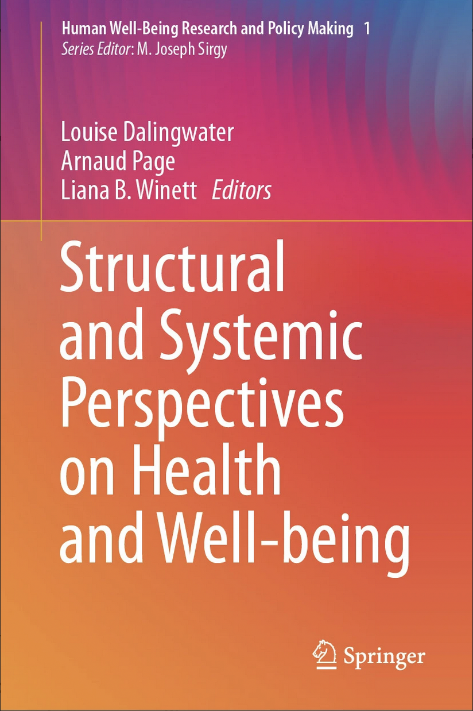

### Louise Dalingwater, Arnaud Page, Liana B. Winett (eds.), _Structural and Systemic Perspectives on Health and Well-being_, Springer, 2025.

Type de publication: Ouvrage collectif

This volume provides a background to debates on definitional terms of subjective and objective wellbeing. Beyond that, it analyses discourse and policy practice relating to population-level and individual health and wellbeing promotion. The chapters in this volume illustrate salient aspects relating to health and wellbeing: how the post-pandemic world seems to be at a tipping point in terms of worsening outcomes for the social determinants of health and wellbeing, how health and wellbeing approaches in the educational sector can be seen as rhetoric devices to promote reform but also as a meaningful way to promote student flourishing; how holistic approaches to health and wellbeing, namely embedding arts and culture in a healthcare setting, can support enhanced wellbeing of frontline healthcare staff; and how specific health and wellbeing issues relating to women and their integration into the workforce remain fraught with difficulty. Finally, the volume analyses efforts to improve health and wellbeing in the face of political turmoil. This highly interdisciplinary volume includes contributions from senior academics and early career researchers in political science, social science, area studies and economics and is an important contribution to the SDG and broader literature on policies related to health and wellbeing.    

#### [Table des matières](Springer_contents.pdf)

Plus d'informations: (https://link.springer.com/book/10.1007/978-3-031-99924-6)

