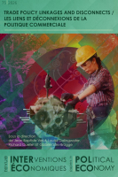

### Louise Dalingwater, Richard Ouellet, Gabriel Siles-Brügge et Jean-Baptiste Velut (eds.), "Understanding Trade Linkages and Trade Disconnects", _Revue Interventions Economiques; Papers in Political Economy_, 2026.

Numéro spécial de revue

[Télécharger le volume](https://journals-openedition-org.accesdistant.sorbonne-universite.fr/interventionseconomiques/pdf/28333)

Louise Dalingwater, Richard Ouellet, Gabriel Siles-Brügge et Jean-Baptiste Velut: "Les liens et déconnexions de la politique commerciale"

Louise Dalingwater, Richard Ouellet, Gabriel Siles-Brügge et Jean-Baptiste Velut: "Trade Policy Linkages and Disconnects"

Ceyhun Elgin: "The Role of Informality in Shaping Economic Policy Integration" 

Adrienne Roberts et Silke Trommer: "Gendered Trade Governance during Covid-19"

Rachel L. Wellhausen et Jean-Baptiste Velut: "The Green Virtues of Chinese Protectionism: A Comparative Analysis of EU and US Responses to the China Garbage Shock" 

Gerry Alons et Pieter Zwaan: "Inclusion or Exclusion of External Voices in Decision-Making on the EU Regulation on Deforestation-Free Products (EUDR): Heard, but Not Listened To"

LY Van Anh: "Environmental Protection in Trade Agreements: A Critical and Constructive View of RCEP" 

Antoine Comont: "Plurilateralism within the WTO as a Catalyst for New Trade Linkages: An Analysis of the JSI on E-Commerce"

Louise Dalingwater: "Furthering Trade and Investment in India’s Healthcare Sector. What Cost to the Public Health Care System?"

Michèle Rioux et Charles-Olivier L’Homme: "From Linkages to Disconnects: The Rapid Response Mechanism (RRM) under the United States-Mexico-Canada Agreement (USMCA)" 

Natalia Serrano Burbano: "Indigenous Participation: Canada's Trade for Reconciliation"

Entretien avec Gabrielle Marceau: "L’OMC appartient au futur"

