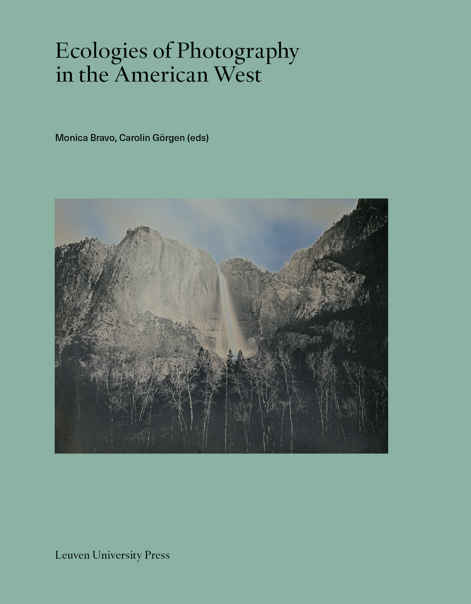

### Carolin Görgen & Monica Bravo (eds.), *Ecologies of Photography in the American West*, Leuven University Press, September 2026. 

Photography and the American West have long been culturally intertwined. Since the 19th century, iconic photographs of western landscapes—think of Carleton Watkins’s Yosemite views—have been read as inherently environmentalist. Challenging this assumption, Ecologies of Photography in the American West examines the medium’s role in documenting, profiting from, and transforming ecosystems across its varied geographies. This book brings together a diverse range of scholars and artists to trace photography’s roots in the earth and its entanglement with resource extraction and ecological rights. Timely and expansive in scope, the volume reframes the history of the region and foregrounds photography’s complicity—as well as its potential—in shaping environmental understanding. It speaks to anyone attuned to the urgent environmental conversations defining the contemporary American West.

Table of contents available here: https://lup.be/book/ecologies-of-photography-in-the-american-west/

## Type de publication:
Ouvrage collectif

Cover image
Binh Danh, *Yosemite Falls, Yosemite, CA (April 15, 2012)*, 2012, Daguerreotype,
8.5 × 6.5 in., The Huntington Library, Art Museum, and Botanical Gardens,
Courtesy of the artist
