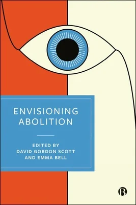

### Emma Bell & David Gordon Scott (eds.), *Envisioning Abolition* (paperback edition), Bristol University Press, 2026. 
Abolitionist thought visualizes a world without prisons – or a radical reduction or transformation of prisons and punishment. This fascinating book explores the abolitionist ideas of key early socialists and anarchists, writing from the late 18th to the early 20th centuries. It considers how these radical thinkers can provide insights into our present condition, both by highlighting the harms of punishment and by pointing to inspiring alternatives to current policy and practice.

By examining their calls for the ending of legal coercion, domination and repression, the book shows how the ideas of early socialists and anarchists can assist those engaging in emancipatory struggles against penal and social injustice today.

Table of contents available here: https://bristoluniversitypress.co.uk/envisioning-abolition

## Type de publication:
Ouvrage collectif
