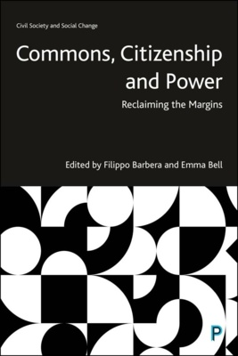

### Filippo Barbera and Emma Bell (eds.), *Commons, Citizenship and Power: Reclaiming the Margins*, Bristol University Press, 2026. 

Since the 2010s, populism and illiberal politics have been on the rise. Demagogue leaders preach simplified rhetoric to vilify the powerless, polarising city and rural areas and sparking such shocking events as the US insurrection on 6th January 2021.

This interdisciplinary book argues for a politics of representativity and accountability to help transform people’s experiences, showing that where they live matters and, therefore, so do they.

This book demonstrates how place-based politics can draw on, and benefit from, collective local knowledge, rather than deferring to a nameless central government. Analysing democratic theory and using rich case studies, from protest movements to citizens’ assemblies it shows how it can return a sense of control to the people.

Table of contents available here: https://https://policy.bristoluniversitypress.co.uk/commons-citizenship-and-power

## Type de publication:
Ouvrage collectif
