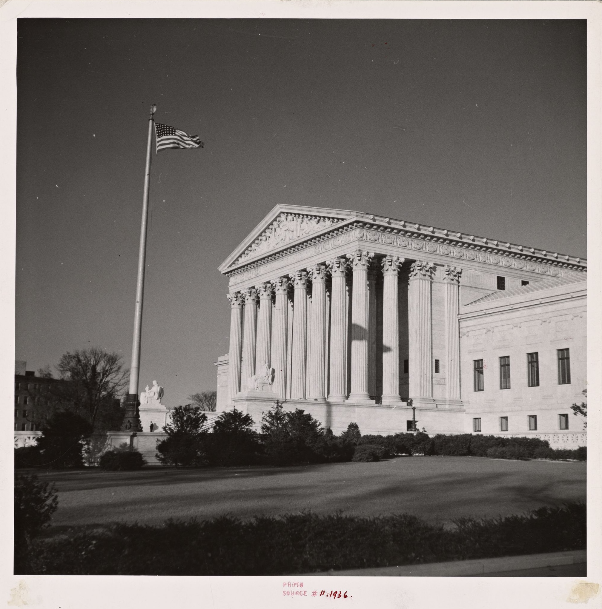

## Axe « Société et gouvernance » 

### Responsables : Louise Dalingwater, Jean-Baptiste Fleury

L’axe « Société et gouvernance » s’intéresse aux interactions entre acteurs économiques, sociaux et institutions dans l’élaboration et l’implémentation des politiques publiques contemporaines dans l’aire anglophone (Royaume-Uni, États-Unis), avec des prolongements en Europe et en Asie. L’axe se focalise également sur le rôle de l’expertise — notamment économique — dans la définition des problèmes publics et des solutions politiques. 

Tout d’abord, les recherches de l’axe examinent les dynamiques à l’œuvre dans les cas concrets des politiques de santé et d’éducation, deux secteurs profondément transformés par les crises budgétaires, les mutations technologiques et la pandémie de Covid-19. Au Royaume-Uni notamment, les réformes du système de santé ont introduit des logiques d’évaluation et de management inspirées du néolibéralisme, avec des effets marqués sur les inégalités et les populations vulnérables. Les travaux adoptent une perspective comparative internationale et multidisciplinaire pour analyser la gouvernance « multi-niveaux » de ces services publics, depuis l’échelle locale jusqu’aux institutions internationales. Ils interrogent ainsi la manière dont l’expertise scientifique, médicale, économique et sociale oriente la formulation des politiques publiques et leurs impacts concrets sur les sociétés contemporaines.

Dans un second temps, les recherches de l’axe se focalisent sur les fondements intellectuels de l’expertise des chercheurs en sciences sociales, en particulier les économistes. En effet, depuis l’après-Seconde Guerre mondiale, l’économie s’est imposée comme une grille dominante d’interprétation des questions sociales, contribuant à rationaliser l’action publique et à redéfinir les rapports entre disciplines scientifiques. Cette « économicisation » des questions sociales a favorisé des politiques fondées sur l’analyse coût-bénéfice, les incitations et le contrôle des comportements, souvent au détriment d’approches plus structurelles ou collectives. Les recherches étudient également le rôle de la normalisation de l’enseignement économique et sa vulgarisation dans l’espace public dans le renforcement de cette vision économique du social et de son influence sur les politiques publiques.

Arthur Rothstein, *The Supreme Court Building, Washington, D.C.*, 1936, The Miriam and Ira D. Wallach Division of Art, Prints and Photographs: Photography Collection, The New York Public Library. New York Public Library Digital Collections.

