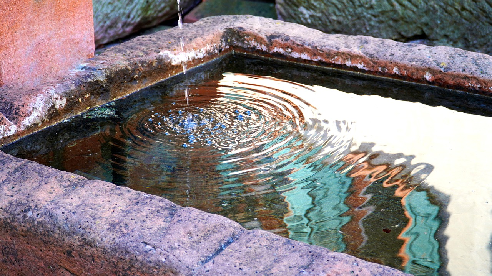

## Titre de la présentation

« L’eau en Palestine : l’émergence d’un problème public et sa gestion par l’administration mandataire britannique (1922-1948) »

## Intervenante 
 Elisabeth Davin-Mortier est post-doctorante au Laboratory for the History of Science and Technology à l’École polytechnique fédérale de Lausanne. Sa thèse intitulée « Les territoires de l’eau en Palestine rurale : une histoire environnementale, sociale et politique durant la domination britannique (1917-1947) », soutenue en 2022 à Sorbonne Université, sera publiée prochainement aux Presses des mines. "

## Date et lieu

 24/10/2024 - Maison de la Recherche –  Salle D421, Sorbonne Université, 28 rue Serpente, 75006 Paris 

## Catégorie

 Séminaire

## Résumé de la communication

 Après la conquête de la Palestine ottomane en 1917, les Britanniques mettent en place une administration civile, à partir de 1920, à laquelle succède l’administration du Mandat confié par la Société des Nations en 1922. Jusqu’à la fin des années 1920, le Gouvernement de Palestine ne comptait ni département ni administrateur chargé de l’évaluation et du contrôle des ressources en eau du pays. La répartition des eaux demeure ainsi mal connue des Britanniques dans les premières années du Mandat. Il faut attendre que l’eau devienne un problème public pour que l’administration mandataire s’y intéresse avec la mise en place de diverses réponses. À la fin des années 1920, de premières inquiétudes émergent autour de la pérennité de l’eau souterraine de la plaine côtière utilisée pour l’agrumiculture. À l’échelle de la Palestine, les craintes qui entourent les ressources en eau résultent également de la confrontation de deux projets politiques concurrents : le projet sioniste d’un Foyer national juif et le nationalisme arabe. Reconnu par la Déclaration Balfour du 2 novembre 1917, le projet d’un Foyer national juif, porté par l’Organisation sioniste, entraîne une colonisation agricole où la maîtrise de l’eau est vitale. La colonisation sioniste, en créant des tensions démographique, économique, et politique entre la population juive et la population arabe, participe à faire de l’eau un sujet politique, technique et juridique majeur de la Palestine mandataire.

Perçue progressivement comme un problème public, la gestion de l’eau est prise en main par l’administration mandataire qui cherche à localiser et évaluer cette ressource et à établir un nouvel arsenal juridique pour la contrôler. Je mettrai en lumière la genèse de la mise sous tension des ressources en eau en Palestine et je présenterai également les réponses apportées par l’administration mandataire britannique et leur réception par les populations arabe et juive.

## Organisateurs du séminaire

Sorbonne Université (Centre d’histoire du XIXe siècle ; Centre Roland Mousnier–UMR 8596 ; HDEA). En partenariat avec le LARCA-UMR 8225 (Université Paris Cité), Agora (Cergy-Paris Université) et l’Institut universitaire de France.

Organisation: Fabrice Bensimon, Emmanuelle de Champs, Jean-François Dunyach, John-Erik Hansson, Frédérique Lachaud, Arnaud Page.

## Contact

 arnaud.page@sorbonne-universite.fr

## Plus d'informations sur le programme

 https://sfbh.hypotheses.org/

