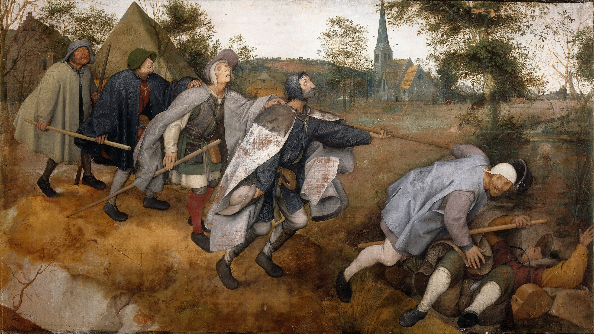

### Sandrine Parageau, « The French Liar », *Aeon*, juillet 2025

René Descartes, the founder of modern philosophy, was furiously condemned by his contemporaries. Why did they fear him?

[The French Liar](https://aeon.co/essays/was-rene-descartes-a-self-centred-guru-and-a-lying-fraud)

