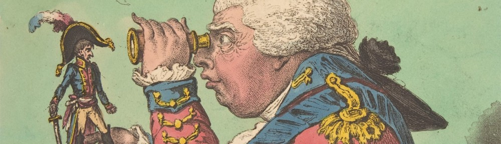

### Séminaire Franco-Britannique d'Histoire 2025-26

Le séminaire a lieu le jeudi de 17h à 18h30, à la Maison de la Recherche, 28 rue Serpente, Paris 6e, salle D421.

 

9 octobre 2025 à 17h : Séance spéciale doctorants. 
Chloé Luneau : « La question nationale dans les mobilisations gaies et lesbiennes dans les deux Irlande (années 1970-1980) »
Lucas Privet (doctorant ENS Ulm – Sorbonne Université) : « “Home Colonization” et “Land Plan” : quelle place pour l’Irlande dans le projet chartiste de mise en culture des terres en friche ? »
Caroline Seyer (doctorante à l’université Paris-Cité) : « Maternité lesbienne et santé des femmes : Penser l’intime ou le politique au sein des lieux militants britanniques, 1970-1990 »

 23 octobre :  Ali Hatapci  (Université de Bourgogne) : “Geographies of Science in Victorian England: Natural History in the Midlands”

 6 novembre : Rory Naismith (Cambridge) : ‘Anglo-Saxon London’

 20 novembre:  Tom Wright (Sussex), ‘The Politics of Oracy and Mid-Victorian Voting Reform” 

 4 décembre : Antti Taipale (Helsinki), “Perspectives on religion as a tool of war in the English Civil War”

 18 décembre:  Oscar Webber (London School of Economics), autour de son livre Negotiating relief and freedom:  Responses to disaster in the British Caribbean, 1812-1907 (Manchester University Press, 2023)

 29 janvier 2026 : Richard Whatmore (St Andrews), “Free states and fanaticism”

 12 février : Ann Thomson (émérite IUE-Florence), “Countering Islamophobia and Catholicism in Grub Street: Joseph Morgan, an early 18th C cultural go-between”

 26 février : Laure Piguet (Fribourg / Centre Marc Bloch, Berlin) : « Enquêter sur sa condition. Fabrication et usages des savoirs par les prisonniers londoniens au XVIIIe siècle »

 12 mars : Juliette Desportes (Highlands), “Resistance to Improvement in the Highlands and Islands, 1750-1820”

 26 mars : Claire Schiano-Locurcio (Montpellier), « Des religieuses en exil : survie et essor du catholicisme anglais aux XVIIᵉ et XVIIIᵉ siècles »

 9 avril : Vic Clarke (Leeds), “’Reviewing Radical Literature in the Chartist Press (1840s)”

7 mai : Ole Birk Laursen (Leibniz), ‘Exile has its privileges’: the Indian revolutionary movement in Europe, 1905–1918″

 

Le séminaire est ouvert à toutes les personnes intéressées, sans inscription, dans la limite des places disponibles.

https://sfbh.hypotheses.org/category/seances

