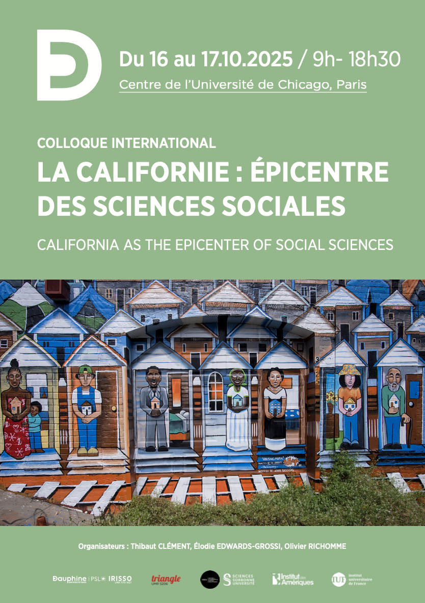

# COLLOQUE INTERNATIONAL : LA CALIFORNIE : ÉPICENTRE DES SCIENCES SOCIALES / CALIFORNIA AS THE EPICENTER OF SOCIAL SCIENCES

16–17/10/2025, 9:00 a.m.–6:30 p.m.
  
The University of Chicago Center in Paris, 41 rue des Grands Moulins, 75013 Paris

Organizers: Thibaut Clément, Élodie Edwards-Grossi, Olivier Richomme, with the support of HDEA-Sorbonne Université, IRISSO-Paris-Dauphine, Institut des Amériques, Institut Universitaire de France, Triangle-Lyon II

## About

This international symposium seeks to bring together recent social science research on California.
  
Drawing on diverse fields (American studies, sociology, social anthropology, history, political science, geography) and a range of methodologies (archival research, oral history, ethnography, participant observation, semi-structured interviews, etc.), these studies shed light on the state’s territorial, social, and racial policies and inequalities through an intersectional lens.
  
The symposium will also provide a space for reflection on the practical and theoretical challenges of fieldwork, particularly for researchers based in France studying distant contexts.

## PROGRAM

### DAY 1 – Thursday, October 16, 2025
  
8:45 a.m. – Coffee and Welcome
  
9:15 a.m. – Opening Speech
  
#### 9:30 a.m. – Keynote Address: Nadia Y. Kim, Professor of Sociology, Texas A&M University

“Refusing Death: Environmental Justice, Immigrants, and the Politics of Emotions”

Chair: Élodie Edwards-Grossi (IRISSO, Université Paris Dauphine–PSL/IUF)

*10:30 a.m. – Coffee Break*

#### 10:45 a.m. – Panel 1: Politiques environnementales et transition écologique / Environmental Policies and the Ecological Transition

Chair: Yves Figuereido (ECHELLES, Université Paris Cité)

Christophe Roncato Tounsi (ILCEA4, Université Grenoble Alpes), “Riding in the margins: tapping the untapped potential of bicycle mobility to accelerate California’s sustainable transition”

Grégory Salle (CNRS), “‘California spillin’: une marée noire entre intrigue judiciaire et affaire sociologique (Baie de San Francisco, 2007–2011)”

Joan Cortinas Muñoz (Centre Émile Durkheim, Université Bordeaux) & Franck Poupeau (IHEAL, CNRS), “L’improbable écologisation des politiques hydriques en Californie”

*12:15 p.m. – Lunch Break*

#### 2:00 p.m. – Panel 2: Marginalités et inégalités (1): Ségrégations et exclusions urbaines / Marginalities and Inequalities (1): Segregation and Urban Exclusions

Chair: Thibaut Clément (HDEA, Sorbonne Université)

Alexandre Pires (Géographie-Cités, Université Paris Cité), “Los Angeles, a Model for Segregating Bodies?”

Sonia Lehman-Frisch (LAVUE, Université Paris Nanterre), “Unequal childhoods in San Francisco”

#### 3:00 p.m. – Panel 3: Marginalités et inégalités (2): Histoires des groupes et populations minorisées / Marginalities and Inequalities (2): The History of Minority Groups and Marginalized Populations

Chair: Thibaut Clément (HDEA, Sorbonne Université)

Emmanuelle Perez Tisserant (FRAMESPA, Université Toulouse Jean Jaurès), “‘Los Tulares’ before Reclamation: Writing the History of Inland California (1830s–1860s)”

Lisa Bratton (Tuskegee University), “Lofas–Lakeside Manor: Documenting Lives from the First Neighborhood in California Built by African Americans for African Americans”

Émilie Cheyroux (CAS, INU Champollion), “‘What is the 2.0 conversation we want to be having?’: the Los Angeles Latino International Film Festival (LALIFF) and the Debate over Representation in the Film Industry”

*4:30 p.m. – Coffee Break*

#### 4:45–6:15 p.m. – Panel 4: La Californie et la fabrique des sciences sociales / California and the Making of Social Science

Chair: Paul Schor (ECHELLES, Université Paris Cité)

Michael Stambolis-Ruhstorfer (CAS, Université Toulouse Jean Jaurès & IUF), “The California Method: State-Based Case Selection in Comparative Sociological Research”

Liora Israël (Centre Maurice Halbwachs, EHESS), “Tensions au cœur du renouveau des études interdisciplinaires sur le droit (Berkeley, 1961–…)”

Gérôme Guibert (IRMECCEN, Sorbonne Nouvelle), “‘When people make the scene’: à propos du travail sociologique de John Irwin”

*7:30 p.m. – Conference Dinner, Bouillon Racine, 3 Rue Racine, 75006 Paris*

### DAY 2 – Friday, October 17, 2025

*9:00 a.m. – Coffee and Welcome*

#### 9:30 a.m. – Panel 5: Marginalités et inégalités (3): Policing and Disciplining / Marginalities and Inequalities (3): Policing and Disciplining

Chair: Olivier Richomme (TRIANGLE, Université Lyon II)

Yohann Le Moigne (3L.AM, Université d’Angers), “From South Central Los Angeles to Pelican Bay: California as a Laboratory for the Study of Racialized Gang Conflict Resolution”

Thomas Chevallier (CriDIS, Université de Louvain), “Los Angeles à l’avant-garde du mouvement ‘Defund the Police’”

*10:30 a.m. – Coffee Break*

#### 10:45 a.m. – Panel 6: Gouvernance et participation / Governance and Participation

Chair: Olivier Richomme (TRIANGLE, Université Lyon II)

Cynthia Boyer (INU Champollion), “California Referendums: Citizenship and Polarization in a Direct Democracy”

Piero Tellerías Melgarejo (Université Paris 1 Panthéon-Sorbonne), “Urban Transformations, Emergencies, and Disasters in Los Angeles: Constructing Civilian Unpreparedness as a Public Policy Issue (1940–1980)”

*11:45 a.m. – Lunch Break*

#### 1:45 p.m. – Panel 7: Résistances, coalitions et mobilisations / Resistance, Coalitions, and Mobilizations

Chair: Marion Marchet (CERAPS, Université de Lille)

Soukayna Mniai (CREA, Université Paris Nanterre), “Addressing Campus Sexual Violence in California: The Role of Grassroots Student Mobilizations, Feminist Organizations, and Lawmakers (1987–2014)”

Guillaume Marché (Université Paris-Est Créteil), “Infrapolitical Interventions in Public Spaces in San Francisco: Centrality and Periphery in Fieldwork-Based Social Science Research”

*3:00 p.m. – Coffee Break*

#### 3:15–4:45 p.m. – Panel 8: Aménagement et politiques publiques / Planning and Public Policy

Chair: Élodie Edwards-Grossi (IRISSO, Université Paris Dauphine–PSL/IUF)

Mathieu Schorung (Médiations, Sorbonne Université), “Des politiques d’aménagement au service de la revitalisation urbaine ? Le cas du centre-ville de San Francisco”

Isabelle Bruno (CERAPS, Université de Lille), “From ‘Sand Rush’ to ‘(Un)Managed Retreat’: California as the Epicenter of a Sea-Change in ‘Coastal Capitalism’”

Marine Dassé (CRESEM, Université de Perpignan), “Espaces postfordistes et villes du spectacle : de la ‘Disneyfication’ à la marchandisation de l’espace urbain en Californie du Sud”

*4:45–6:15 p.m. – Cocktail Reception*

### [Télécharger le programme](Programme_Californie.pdf)

