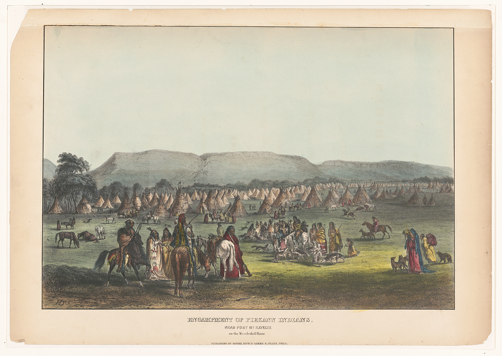

### Journée Publications récentes RéDEHJA
17/10/2025
Sorbonne Université, site Malesherbes, 108 boulevard Malesherbes, Paris 17e

Journée organisée avec le soutien d’HDEA (Sorbonne Université), Transcrit (Paris 8) et RéDEHJA

Organisatrices : Nathalie Caron et Gabrielle Guillerm, HDEA, Sorbonne Université; Claire Bourhis-Mariotti, Transcrit, Paris 8

Contact : nathalie.caron [at] sorbonne-universite.fr ; gabrielle.guillerm [at] sorbonne-universite.fr

# Programme

## Programme matin I – amphi 122

9h15 : accueil et ouverture de la journée par Sandrine Parageau, directrice de l’unité de recherche HDEA

9h45-10h30 : Virginie Adane, *1619. L’autre naissance des États-Unis*, PUF, collection « Une année dans l’Histoire », 2024

Commentaire : Anne-Claire Faucquez, Université Paris 8

10h30-11h15 : Agnès Delahaye, *Aventuriers, pèlerins, puritains. Les mythes fondateurs de l’Amérique*, Passés/Composés, 2024

Commentaire : Gabrielle Guillerm, Sorbonne Université

*11h15-11h30 : Pause Café*

## Programme matin II - amphi 122

11h39-12h15 : Claire Parfait et Michaël Roy, et Simone Chambon, traduction, notes et introduction, *Moses Roper, Josiah Henson. Deux récits d’esclaves fugitifs*, Presses universitaires de Rouen et du Havre, 2025

Commentaire : Laurence Cossu-Beaumont, Sorbonne Nouvelle

12h15-13h : Isabelle Sicard, *Financer le culte ? Pétitions citoyennes et affirmation démocratique au Massachusetts, 1776-1833*, Sorbonne Université Presses, collection Mondes anglophones, 2024

Commentaire : Cécile Coquet Mokoko, Université Versailles Saint-Quentin

*Déjeuner (buffet) – cafeteria*

## Programme Après-midi I – amphi 111

14h30-15h15 : Élodie Peyrol-Kleiber, L. H. Roper, Bertrand Van Ruymbeke and Agnès Delahaye, ed. *Agents of European Overseas Empires: Private Colonisers, 1450-1800*, Manchester University Press, 2024.

Commentaire : Soazig Villerbu, Université de Limoges

15h15-16h : Élise Marienstras, *Mémoires sans mémoire*, Atlande, 2025.

Commentaire : Marine Le Puloch, Sorbonne Nouvelle

*16h-16h15 : Pause café*

## Programme Après-midi II – amphi 111

16h15 : Remise du prix Élise Marienstras

Finalistes : Virginie Adane, *Aux origines de New York. Femmes et hommes dans la formation d'une société nouvelle* (Presses Universitaires de Rennes, 2024) ; Gilles Havard, *Les Natchez : vie et destin d'un peuple nord-américain* (Tallandier, 2024) ; Martin Robert, *Cette science nécessaire. Dissections humaines et formation médicale au Québec* (MacGill-Queen’s University Press, 2023) ; Michaël Roy, *Young Abolitionists: Children of the Antislavery Movement* (New York University Press, 2024)

## 17h Cocktail – cafeteria

[Programme](2025_prog_Redehja.pdf)

Illustration: Bodmer, Karl, Artist. Encampment of Piekann Indians, near Fort McKenzie on the Muscleshell sic River / HD. Montana, 1842. (Philadelphia: Published by Daniel Rice & James G. Clark, Phila) https://www.loc.gov/item/96522963/.

