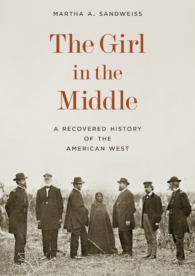

## Rencontre autour du livre de Martha A. Sandweiss, *The Girl in the Middle* (2025)

Le vendredi 24 octobre 2025 de 17:00 à 19:00

Musée du Quai Branly, Salon de Lecture Jacques Kerchache 

## Martha Sandweiss (Princeton University) en conversation avec Carolin Görgen (Sorbonne/HDEA/IUF)

En 1868, Alexander Gardner, célèbre photographe de la guerre civile américaine, se rendit à Fort Laramie afin de documenter les négociations menées par le gouvernement fédéral avec les Lakotas et d'autres nations des plaines du nord en vue de la signature d'un traité. Gardner, connu pour son portrait emblématique d'Abraham Lincoln et ses photos poignantes des soldats confédérés morts à Antietam, fit poser six commissaires fédéraux chargés des négociations de paix aux côtés d'une jeune fille amérindienne enveloppée dans une couverture. 
Martha A. Sandweiss brosse un portrait captivant de l'époque tumultueuse de la Reconstruction et de l'expansion vers l'Ouest. Elle suit Gardner depuis son lieu de naissance en Écosse jusqu'à la frontière américaine, alors que ses rêves d'un avenir utopique outre-Atlantique s'effondrent. Elle raconte la vie de William S. Harney, un général de l'Union propriétaire d'esclaves qui a mérité le nom lakota de « tueur de femmes », et celle de Samuel F. Tappan, un abolitionniste qui a mené l'enquête sur le massacre de Sand Creek. Elle identifie également Sophie Mousseau, la jeune fille sur la photographie de Gardner, dont la vie a pris un tournant inattendu lorsque les colons américains ont envahi les terres amerindiennes et que le gouvernement fédéral a confiné les peuples autochtones dans des réserves. À partir d'une seule image énigmatique, *The Girl in the Middle* tisse un récit historique captivant qui révèle comment la nation américaine s'est interrogée sur le type de pays qu'elle souhaitait devenir alors qu'elle s'étendait vers l'ouest au lendemain de la guerre civile. (4e de couverture)

## Plus d’informations ici :
https://www.quaibranly.fr/fr/expositions-evenements/au-musee/rendez-vous-du-salon-de-lecture-jacques-kerchache/details-de-levenement/e/the-girl-in-the-middle-40761

