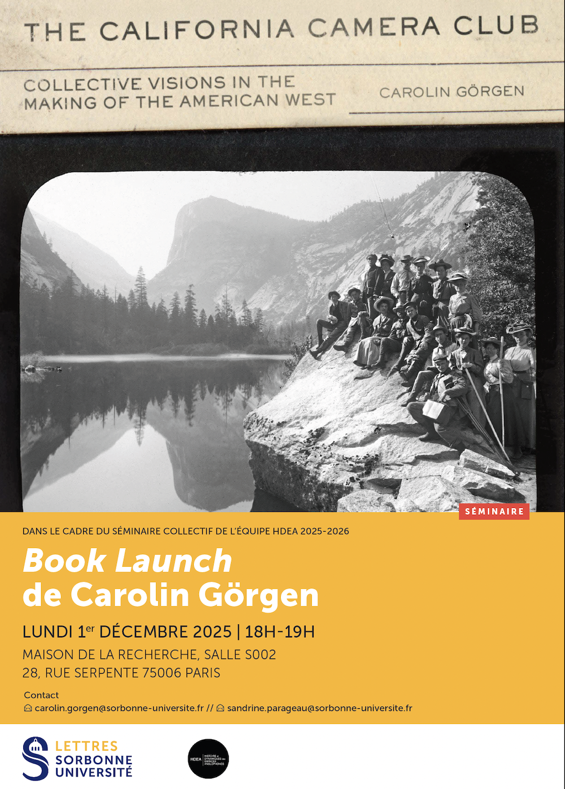

## Book launch de Carolin Görgen, *The California Camera Club: Collective Visions in the Making of the American West* (University of Oklahoma Press, 2025)

Le lundi 01 décembre de 18:00 à 19:00

Maison de la Recherche Sorbonne Université, Salle 002

28 Rue Serpente, 75006 Paris

### Résumé

Basé à San Francisco, le California Camera Club fut le plus grand club de photographes des États-Unis au début du XXᵉ siècle. L’ouvrage retrace l’histoire oubliée de ce groupe, de ses membres — femmes et hommes — et de leur contribution essentielle à la construction de l’imaginaire de la Californie et de l’Ouest américain en tant que territoire photographique. Bien qu’il ait joué un rôle déterminant dans la carrière d’Ansel Adams et d’autres « grands noms » de la photographie américaine, le club a surtout favorisé la pratique collaborative de la photographie en plein air. À travers cette histoire, l'autrice offre une nouvelle perspective sur la photographie américaine au tournant du siècle et sur ses pratiques collectives. 
Issu d’un travail de thèse (2018) mené sous la direction de François Brunet et de Dominique de Font-Réaulx, ce livre est le fruit de dix années de recherches. Il comprend une centaine d’illustrations, pour la plupart inédites, provenant d’une vingtaine d’archives à travers l’Ouest américain. 
Plus d'informations via ce lien : https://www.oupress.com/9780806196039/the-california-camera-club/

