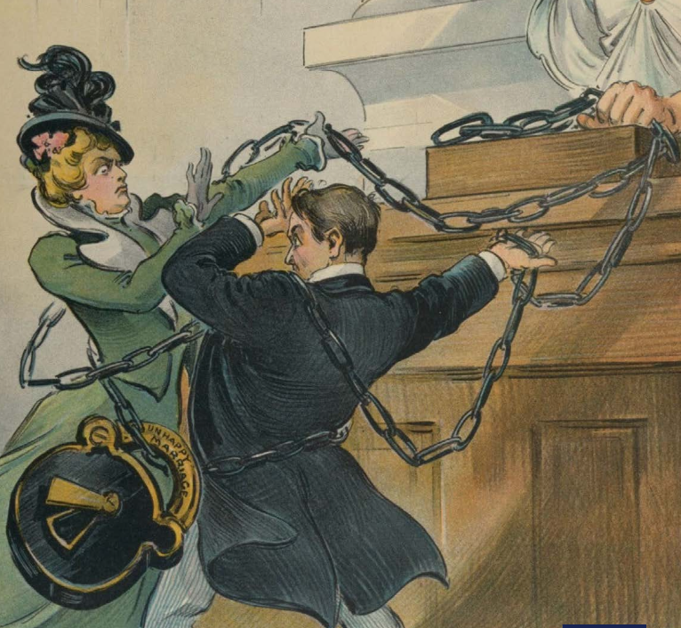

---

## Colloque Les femmes et leurs droits dans le long XIXe siècle : stratégies d’acquisition du statut de sujet de droit dans l’espace anglo-américain
07–08/04/2026
  
Sorbonne, Salle des Actes, 17 rue de la Sorbonne, Paris
Organisatrices: Charlotte Brivio & Pauline Marshall

#### MARDI 7 AVRIL 2026
10h00 Accueil et ouverture du colloque au Club
Pauline Marshall (Sorbonne Université)
Charlotte Brivio (Sorbonne Université)

##### 10h30 Conférence plénière
Claire DELAHAYE (Université Gustave Eiffel) : Mobilizing and performing History: Bodies, Objects, and Spectacle in Suffragist Political Culture

11h30 Échange*

*12h00 Déjeuner au Club (pour les intervenants)*

##### PANEL 1 : Reclaiming one’s Body : struggles for recognition in the UK
Présidente de séance : Jaine CHEMMACHERY (Sorbonne Université)
13h30 Myriam BOUSSAHBA-BRAVARD (Université Le Havre Normandie): Avant et après les Lois sur la propriété des femmes mariées de 1882 et 1884 : quand les épouses deviennent individus
14h00 Muriel PECASTAING-BOISSIÈRE (Sorbonne Université): Les luttes juridiques pionnières menées par Annie Besant pour le contrôle de leur corps par les Victoriennes
14h30 Échange

*15h00 Pause café au Club*

##### PANEL 2 : Constructing Narratives of Women’s Resistance: U.S. Amendments in Focus
Président de séance : William SLAUTER (Sorbonne Université)

15h30 Charlotte BRIVIO (Sorbonne Université): Representing Women in Court: Press coverage of ‘New Departure’ Test Cases
16h00 Amélie RIBIERAS (Université Panthéon Assas): Le combat de Phyllis Schlafly contre l’Equal Rights Amendment aux Etats-Unis (1972-82) : échos d’un passé victorien et effets de miroir militants

16h30 Échange
17h00 Fin de la première journée

#### MERCREDI 8 AVRIL 2026

*9h00 Accueil café au Club*

##### 9h30 Conférence plénière
Anne SCHWAN (Napier University, Edinburgh): ‘Punning and Leering’ in the Law Courts: Challenging Legal Bias and Media Trial Reports through Nineteenth-Century Women’s Prison Autobiography

10h30 Échange

##### PANEL 3 : Ideological Tensions and Nonconformity under Watch
Président de séance : Arnaud PAGE (Sorbonne Université)
11h00 Fabrice BENSIMON (Sorbonne Université): La police française et les suffragettes anglaises
11h30 Joelle GORNO (Sorbonne Université) : Women’s Liberal Association’s and the Suffrage Movement in Wales
12h00 Échange

*12h30 Déjeuner au Club (pour les intervenants)*

##### PANEL 4 : Writing Women’s Rights
Présidente de séance : Marie DUIC (Sorbonne Université)

14h00 Claire WROBEL (Université Panthéon Assas): A Literary Vindication of the Rights of Woman? Problematic Proto-Feminism in Frances Burney’s *The Wanderer; or, Female Difficulties* (1814)
14h30 Pauline MARSHALL (Sorbonne Université): How Did Women Writers Learn the Law? Jane Austen and Legal Knowledge in the 19th Century
15h00 Alice DE GALZAIN (Sorbonne Université) Brook Farm, *The Harbinger*, and Women’s Rights

15h30 Échange
16h15 Conclusion et clôture du colloque
*16h30 Pot de fin de colloque au Club*

#### [Télécharger le programme](Femmes_et_droit.pdf)

