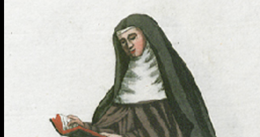




 
## "Séminaire Culture & religion", Vendredi 10 avril, de 14h à 17h30, séance Reclus et recluses
Claire Schiano-Locurcio  (Université Paul Valery-Montpellier III) : « Entre mission anglaise et enracinement local : les clarisses exilées sur le continent aux XVIIe et XVIIIe siècles. »


Eva Gourdoux (Université Toulouse Jean Jaurès / C.A.S.) : « Du cloître à la plantation : héritage européen et réinvention sudiste de la figure du reclus chez William Faulkner, Flannery O'Connor et Eudora Welty. » (en ligne)

## Date
10/04/2026

## Lieu
Bibliothèque de l’UFR d’études anglophones, Sorbonne Université, 14h à 17h30.

Il est possible d'assister aux séances en distanciel ; merci de contacter les organisateur·ices pour le lien Zoom. 

## Organisateur(s)
Rémy Bethmont, Transcrit (Paris 8) et Nathalie Caron, HDEA (Sorbonne Université)

## Contact
nathalie.caron@sorbonne-universite.fr

