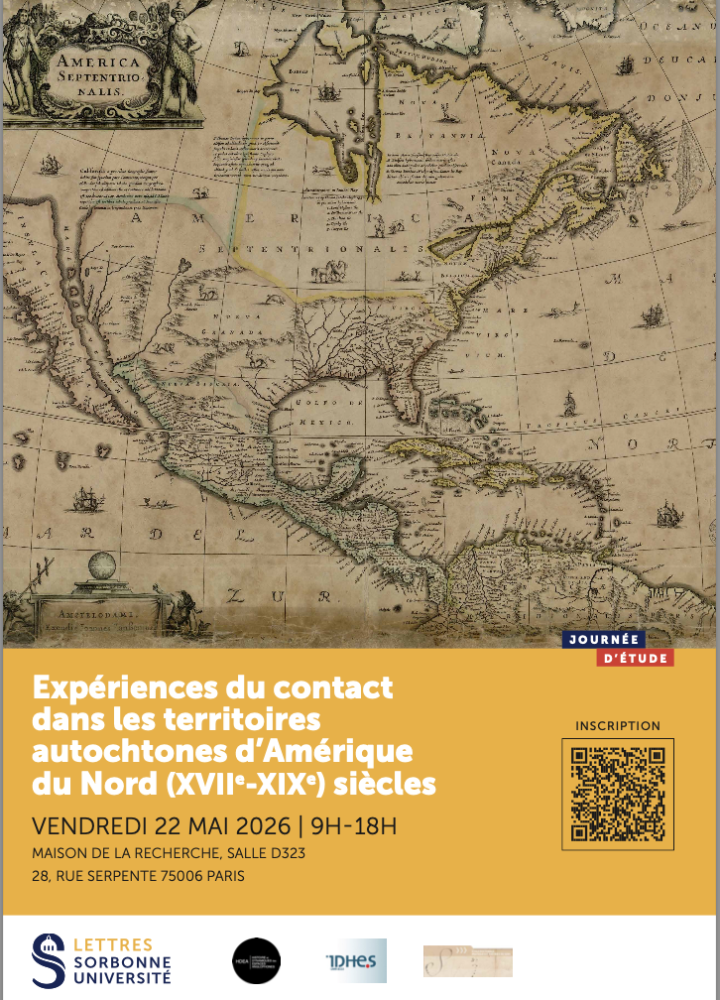

## Journée d'Etudes : Expériences du contact dans les territoires autochtones d’Amérique du Nord (XVIIe-XIXe siècles)
22/04/2026

Sorbonne Université, Maison de la recherche, 28 rue Serpente, 75006 Paris, salle d323

Comité d’organisation : Robert Coatsworth (Sorbonne Université), Gabrielle Guillerm (Sorbonne Université), Donia Menghini (Université Paris 8), Maïann Stachnik (Sorbonne
Université)

#### 8h30-9h: Café accueil / Welcome coffee

#### 9h-9h15: Introduction Robert Coatsworth (Sorbonne Université), Donia Menghini (Université Paris 8), Maïann Stachnik (Sorbonne Université)

### 9h15-11h05: Panel 1 : Circulations, adaptations et continuités des pratiques culturelles autochtones / The Circulation, Adaptation and Continuity of Indigenous Cultural Practices

Panel chair: Nathalie Caron (Sorbonne Université)

- Marian Leech (University of Pennsylvania): Fur Carpets, Axe Pendants, and Shell Beads: Retracing Narratives of “First Contact” Across Dutch and Delaware Traditions
- Cameron B. Strang (University of Nevada): Indigenous Explorers and the Long Intellectual History of Survival
- Augustin Habran (Université d’Orléans): “Contact zones” in the Great Plains: The emergence of Indian Territory and reconsideration of Indigenous agency in the West
- Benjamin Balloy (CNRS - Université Toulouse Jean Jaurès): "Frapper au poteau" (Striking the Post): Considerations on a Form of Ritual Interaction

#### 11h05-11h20: pause café / coffee break

### 11h20-12h30: Panel 2 : Race et esclavage : expériences et constructions transculturelles / Experiencing and Producing Race and Enslavement across Cultures

Panel chair: Gabrielle Guillerm (Sorbonne Université)

- Linford Fisher (Brown University): Experiencing Enslavement in Colonial America: Indigenous Perspectives on the Threat of Slavery in Warfare and During Slave Trades
- Taryn M. Dixon (Northwestern University): Controlling Space and Race in Indian Territory: the Construction of White and Black Illegality through Racial Exclusion Laws in Post-Removal Choctaw Nation

#### 12h30-14h00: déjeuner / lunch break

### 14h00-15h50: Panel 3: Diplomatie et pratiques militaires en territoires autochtones / Diplomacy and Military Practices in Indigenous Territories

Panel chair: Donia Menghini (Université Paris 8)

- Guillaume Teasdale (University of Windsor) : Before Pontiac: The Huron Plot of 1747 and the Crisis of French Detroit
- Agnès Trouillet (Université Paris Nanterre): Gansho-Wanne, “The Roaring River”: The Schuylkill as a Crucible for Resistance and Change in 17th-Century Delaware Valley
- Maxence Terrollion (Université du Québec): Forts frontaliers et frontières sans forts : l’affirmation des souverainetés autochtones du nord de la vallée de l’Ohio dans les luttes d’empire (1726-1760)
- Mathieu Taloté (Nantes Université): Man is a prey to man. Hostages and first contact strategies in the Canadian Arctic (1576-1578)

##### 15h50-16h20: pause café / coffee break

### 16h20-17h50: Panel 4: Raconter le contact : témoignages, récits et savoirs autochtones / (Re)telling the History of Contact : Indigenous Testimonies, Narratives and Knowledge

Panel chair: Will Slauter (Sorbonne Université)

- Mairin Odle (University of Alabama): ‘Covering him with the same bear-skin’: Narratives of a Transatlantic Seminole Childhood, 1838-1843
- Eduardo Angel Cruz (KU Leuven): Sanctity as Ethnography: Indigenous Witnesses and Negotiated Experiences of the Holy in 17th Century New Spain
- Laurie Arnold (Gonzaga University): Dialogues of Contact: Native American Plays as Archival Sources

#### 17h50-18h: Conclusion: Robert Coatsworth (Sorbonne Université), Donia Menghini (Université Paris 8), Maïann Stachnik (Sorbonne Université)

#### 18h: Pot de clôture / Goodbye drinks

#### [Télécharger le programme](JE_Contact.pdf)

