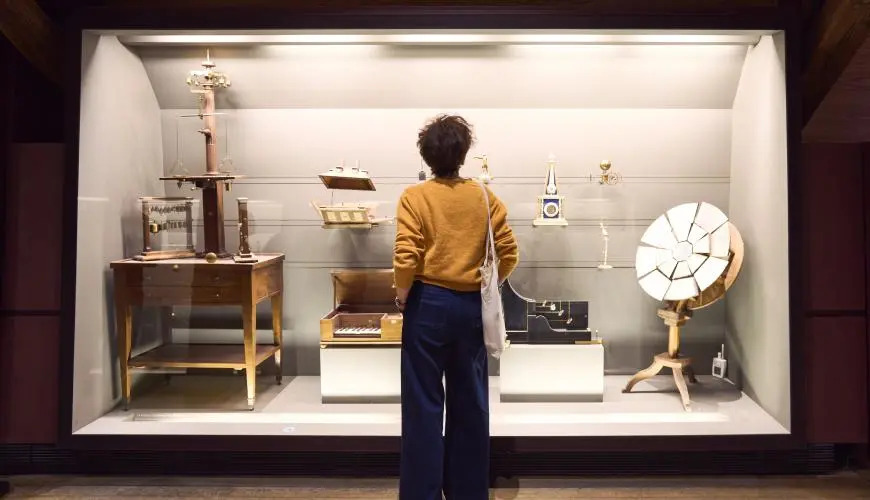
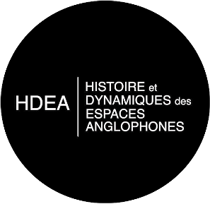

## Journée d’Etudes conjointe Sorbonne Université & Cnam : L’invisibilisation des femmes dans les sciences et les techniques en France et en Angleterre (XVIIe-XIXe siècles)

### 12 juin 2026, 9h30-19h00

#### Amphi Abbé Grégoire, Cnam, 292 rue Saint-Martin, 75003 Paris

Pascal, Newton, Halley, Faraday, Lavoisier, Ampère, Pasteur : on connaît bien tous ces héros de l’histoire des sciences et des techniques des XVIIe-XIXe siècles. Mais existe-t-il des héroïnes dans cette histoire ? Quelques noms viennent à l’esprit : Émilie du Châtelet, bien sûr ; Ada Lovelace, peut-être. Mais on les connaît grâce à un homme plus célèbre qu’elles : Voltaire, Lord Byron et Charles Babbage. Marie Curie semble faire exception. Au-delà de ces figures souvent présentées comme « extraordinaires », d’autres femmes ont-elles participé à l’histoire des sciences et des techniques ? À quelle science se sont-elles intéressées et quelle a été leur pratique ? Comment et où ont-elles accédé aux sciences et aux techniques dans un contexte intellectuel, institutionnel et juridique qui les en éloignait ? Si des femmes ont bien pratiqué la science du XVIIe au XIXe siècle en Angleterre et en France, pourquoi sont-elles aujourd’hui inconnues et invisibles ? On peut penser que, dans certains cas, elles n’ont laissé que peu de traces dans l’histoire. Mais peut-être aussi ont-elles été invisibilisées, écartées des grands récits de l’histoire des sciences et des techniques, parfois au profit de leurs pères, de leurs frères et de leurs époux.

Journée organisée par Line Cottegnies et Sandrine Parageau (Sorbonne Université), ainsi que Anne-Laure Carré et Anne Chanteux (Cnam), dans le cadre du projet SPHINX, avec le soutien des laboratoires HDEA (UR 4086) et VALE (UR 4085).

## Programme de la journée

*9h15 : accueil et mot d’ouverture* par Michèle Antoine, directrice du Musée des Arts et Métiers

9h30-10h00 : Isabelle Lémonon-Waxin (Nantes Université, Centre François Viète) 
« Les savantes des Lumières françaises ont-elles une histoire ? »

10h00-10h30 : Louisiane Ferlier (Royal Society, Londres)  
« Traces et silences : à la recherche des femmes dans les collections de la Royal Society »

10h30-11h00 : discussion 

*11h00-11h15 : pause*

11h15-11h45 : Lou-Ann Rouchon  
« Entre reconnaissance institutionnelle et invisibilisation : l’ingéniosité des femmes à l’épreuve de la Society of Arts de Londres (1754-1847) »

11h45-12h15 : Anne-Laure Carré (Musée des Arts et Métiers) 
« La collection des modèles des arts et métiers et manufactures du Duc d’Orléans, projet pédagogique de Mme de Genlis ou reflet d’une galerie aristocratique ? »

12h15-12h45 : discussion

*12h45-14h00 : déjeuner* (sur place pour les intervenant.e.s)

14h00-14h30 : Anne Chanteux (Conservatoire National des Arts et Métiers)
« La pratique des techniques par les femmes : l’invention au XIXe siècle à travers les archives historiques du Cnam » 

14h30-15h00 : David Aubin (Sorbonne Université, Institut de mathématiques, Initiative iRHiST) 
« Pourquoi la Revue scientifique des femmes (1888-1889) ? Masculinité normative et déviance féminine »

15h00-15h30 : Emmanuelle de Champs et Constanza Rojas-Molina (CY Cergy Paris Université)
« Contre l’invisibilisation des femmes scientifiques des Lumières : à la croisée des mathématiques et de l’histoire »

15h30-16h15 : discussion

*16h15-16h30 : pause*

16h30-17h30 : Table ronde : « L’invisibilisation des femmes dans l’histoire des sciences et techniques : perspectives croisées »
Animée par Liliane Hilaire-Pérez (Paris Cité/EHESS), avec Sandrine Aragon (Sorbonne Université, CELLF), David Aubin (Sorbonne Université, Institut de mathématiques, Initiative iRHiST), Louisiane Ferlier (Royal Society, Londres), Catherine Lanoë (Université Versailles Saint-Quentin)

*17h30 : visite libre du Musée* - inscription obligatoire *avant le 3 juin* [via ce lien](https://docs.google.com/forms/d/e/1FAIpQLSd9NrS7kSWIZZnQ5aWDSMVdSV7oR6prpofs-KbXGw0TO7km0Q/viewform)

##### Cette journée d’étude a bénéficié d'une aide de l’État gérée par l'Agence Nationale de la Recherche au titre de France 2030, dans le cadre du projet SPHINX (ANR 24 RSHS 0006), porté par Sorbonne Université 

Illustration : Musée des Arts et Métiers-Cnam, photo Guillaume Murat.

   

