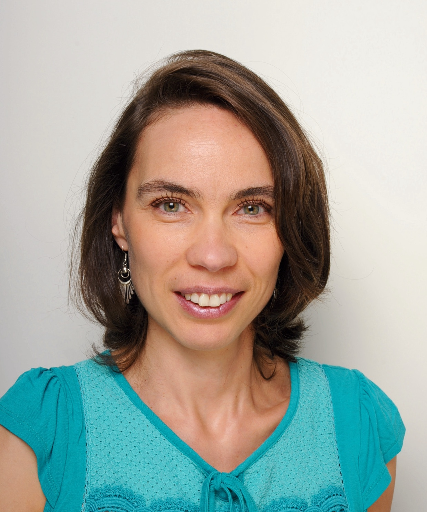

## Contact

gabrielle.guillerm@sorbonne-universite.fr

## Thèmes de recherche

Gabrielle Guillerm is Associate Professor of American and US history. She specializes in the intersection of religion and race in America. Her current book project, based on her dissertation, explores the role of French Catholic missionaries in entrenching white supremacy in the Midwest after the American Revolution. In 2022-2024, she worked as the researcher coordinator for a project that seeks to confront the history and legacy of a Catholic boarding school meant to assimilate Lakota children of the Pine Ridge reservation (South Dakota) to white Christian culture. 

## Research Topics:

- Native American and Indigenous Studies (especially the history of colonialism and settler colonialism in Early America and the United States & the history and legacy of Native American boarding schools). 
- U.S. Westward Expansion
- White supremacy
- Religious history
- Early America (especially 1763-1860) and the Age of Revolutions

## Articles dans une revue

Gabrielle Guillerm, “(Un)holy Trade: Ecclesiastical Slavery, French Missionaries, and Catholic Westward Expansion in the Early Republic,” *Journal of the Early Republic* (forthcoming 2025)

Gabrielle Guillerm, “Reckoning with the Jesuits’ Role in the US Federal Policy of Assimilation: The Truth and Healing Project at Mahpíya Lúta/Red Cloud,” *Jesuit Educational Quarterly*, Special Issue on Jesuits, Race, and Slavery (under review)

## Chapitres dans un ouvrage collectif

Gabrielle Guillerm, “Le Père David, émigré et artisan d’une Eglise catholique authentiquement américaine.” In *Les Français et les Etats-Unis, 1789-1815 : Marchands, exilés, missionnaires et diplomates*. Edited by Tangi Villerbu. Rennes: Presses universitaires de Rennes, 2017.

## Autres publications

Gabrielle Guillerm, Caption of Petit Catéchisme (1815). In *Religion and the American West: Belief, Violence, and Resilience from 1800 to Today*. Edited by Jessica Lauren Nelson. University of New Mexico Press, September 2023. 

## Interventions orales récentes

“French Missionary Nuns as Agents of Settler Colonialism in the Age of Indian Removal,” Organization of American Historians Annual Conference, Chicago, April 3, 2025 (presentation in absentia due to maternity leave). 

“Suprématie Catholique. Les missionnaires français et l'expansion vers l'Ouest dans les jeunes États-Unis,” Religion and Culture Seminar, organized by Nathalie Caron and Rémy Bethmont, Session on “Religion and Race,” Sorbonne Université, Paris, February 21, 2025

 “Suprématie catholique,” Nineteenth-Century Worlds Seminar (W 19), organized by Auréliane Narvaez and Michael Roy, comments by Domitille de Gavriloff, Nanterre Université, Nanterre, January 24, 2025

Panelist, Roundtable “Beyond Archival Silences: Clergy Abuse and Catholic History,” Annual Meeting of the American Catholic Historical Association, New York City, January 5, 2025

“From Assimilationist Teachings to Native Studies: Educating Lakota Children at Holy Rosary Mission Boarding School, 1888-1980,” Annual Meeting of the American Catholic Historical Association, New York City, January 4, 2025

“Catholic Supremacy: French Missionaries and Westward Expansion in the Early Republic,” Workshop on New Directions in Research on Global Catholicism: Mobilities, Migrations, Circulations, Center for Research on Global Catholicism, Saint Louis University, January 26, 2024

“Historians and the Work of Truth and Healing: The Example of Mahpíya Lúta (Red Cloud),” Annual Meeting of the American Catholic Historical Association, San Francisco, January 2024

“The Age of Bishops and Cathedrals,” Religion and Culture in the Americas Seminar, Newberry Library, February 3, 2023

“Catholic Missions and Anishinaabe Diplomacy in the Western Great Lakes, ca. 1820s-1850s,” Society for Historians of the Early American Republic Annual Meeting, New Orleans, July 24, 2022

“From Enslaved Woman to Member of a White Religious Community: Liza Nebbit, Racial Catholicism, and Afro-Catholicism in Louisiana,” Annual Meeting of the American Historical Association/American Catholic Historical Association, New Orleans, January 2022

## Autres/Divers

### Recent Fellowships and Grants

Fellow, Seminar on “New Directions in Research on Global Catholicism: Mobilities, Migrations, Circulations,” Center for Research on Global Catholicism, Saint Louis University, January 2024-April 2025

Mother Theodore Guérin Grant, Cushwa Center for the Study of American Catholicism, University of Notre Dame, 2024

Participant, American Catholic Historical Association initiative “Native Boarding Schools, Historical Research, and Catholic Archives,” funded by the National Endowment for the Humanities, granted through the American Historical Association, 2022-2023

Chabraja Newberry Library Postdoctoral Fellow, Chabraja Center for Historical Study, Northwestern University, 2021-2022

Richard S. Dunn Dissertation Fellow and E. Rhodes and Leona B. Carpenter Fellow in Early American Religious Studies, McNeil Center for Early American Studies, University of Pennsylvania, 2020-2021

Graduate Scholar-in-Residence, Newberry Library, Chicago, 2019-2020

### Awards and Honors

Harold Perkin Dissertation Prize, History Department, Northwestern University, 2022

Finalist, Society for Historians of the Early American Republic (SHEAR) Dissertation Prize, 2022

## Liens vers d’autres pages

https://sorbonne-universite.academia.edu/GabrielleGuillerm 

https://mahpiyaluta.org/the-missions/initiatives/truth-and-healing/ 
