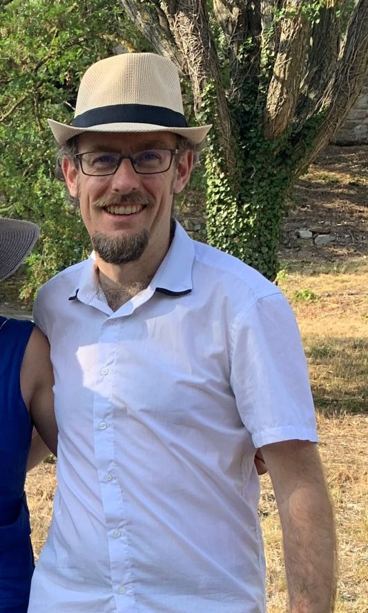

## Contact

 steven.oconnor@sorbonne-universite.fr

## Thèmes de recherche

 Focusing on Britain, Ireland and France, my main research interests are in military, social and transnational history, 1900-1945:
- The British army's approach to coalition warfare during the Second World War
- The experiences of the Free French forces serving under British command
- The Irish tradition of service in the British armed forces

## Ouvrages et directions de numéro de revue

 *Irish Officers in the British Forces 1922-45*, Basingstoke, Palgrave Macmillan, 2014, 272 pages. A second edition was published in 2017.

"Foreign fighters and multinational armies: from civil conflicts to coalition wars, 1848-2015," *European Review of History-Revue européenne d'histoire*, Vol. 27, N° 1-2 (mars 2020), co-edited by Steven O'Connor and Guillaume Piketty. Routledge published a book version of this special issue in 2022 and a paperback edition in 2024.

## Articles dans une revue

 « Introduction - Foreign fighters and multinational armies: from civil conflicts to coalition wars, 1848-2015 », *European Review of History-Revue européenne d'histoire*, Vol. 27, N° 1-2 (mars 2020), p. 1-11 (Steven O'Connor and Guillaume Piketty).

« The Free French and British Forces in the Desert War, 1942: The Learning Curve in Interallied Military Cooperation », *European Review of History-Revue européenne d'histoire*, Vol. 27, N° 1-2 (mars 2020), p. 176-98.

« Under a foreign flag: integrating foreign units and personnel in the British and German armed forces, 1940-1945 », *Journal of Modern European History*, Vol. 14, N° 3 (novembre 2016), p. 321-41 (Steven O'Connor and Martin Gutmann). 

« Why did they fight for Britain? Irish recruits to the British forces, 1939-45 », *Etudes Irlandais-es*, Vol. 40, N° 1 (Printemps-été 2015), p. 59-70. 

« Irish identity and integration within the British armed forces, 1939-1945 », *Irish Historical Studies*, Vol. 39, N° 155 (mai 2015), p. 417-38. 

« The pleasure culture of war in independent Ireland, 1922-45 », *War in History*, Vol. 22, N° 1 (janvier 2015), p. 66-86.

## Chapitres dans un ouvrage collectif

 « Fighting a coalition war: the experience of the Free French soldier in the British 8th Army » dans Claire Miot, Guillaume Piketty et Thomas Vaisset (dir.), *Militaires en résistances en France et en Europe*, Lille, Presses universitaires du Septentrion, 2020, p. 151-65.

« 'It's up to you now to fight for your own country': Ireland's Great War veterans in the War of Independence, 1919-21 » dans David Swift et Oliver Wilkinson (dir.), *Veterans of the First World War: Ex-Servicemen and Ex-Servicewomen in Post-War Britain and Ireland*, London, Routledge, 2019, p. 104-21.

« Imperial continuities: Irish doctors and the British armed forces, 1922-1945 » dans Ian Miller et David Durnin (dir.), *Medicine, Health and Irish Experiences of War, 1914-1945*, Manchester, Manchester University Press, 2016, p. 191-205.

## Interventions orales récentes

 « L'intégration des Français libres au sein de la Huitième armée britannique », journée d'études Bir Hakeim et les Premiers Combats de la France Libre 1940-1942, Service Historique de la Défense, Château de Vincennes, 1 juin 2022.

« The Irish Experience in the British forces: complicating and challenging the Irish state's national narrative », table ronde en ligne Alternative Armies: Questioning National Narratives about the Second World War, organisé par le Second World War Research Group et le Sir Michael Howard Centre for the History of War, King's College London, 28 janvier 2022.

« 'This French force must be an asset and not a liability': the British approach to coalition warfare during the Second World War », Séminaire d'histoire franco-britannique, Sorbonne Université, 27 février 2020.

« The Free French Forces in the Desert War, 1942: A Victory for the British Liaison System? », journée d'études Fighters in Foreign Conflict, 1848-1999, Centre d'histoire de Sciences Po, 28 juin 2018.

« Combattre dans une guerre de coalition : l'expérience du soldat Français Libre au sein de la Huitième armée britannique », colloque Militaires en Résistances, Château de Vincennes, 13-14 juin 2018.

« Irish recruitment to the British forces, 1922-1945 », journée d'études The Disbandment of the Irish Regiments, 1922: Consequences and Continuities, Trinity College Dublin, 11 novembre 2017.

## Vulgarisation et interventions dans les média

 « Britain's Irish soldiers in the Second World War », The Revolution Papers, N° 77 (20 juin 2017), p. 4.

« Trained by the British, fighting for Ireland: Great War veterans bring valuable experience to the IRA », The Revolution Papers, N° 33 (16 aout 2016), p. 4 (download: https://www.academia.edu/28314075/Trained_by_the_British_fighting_for_Ireland).

« 24 April 1916 - The Easter Rising: What the papers say », The Revolution Papers, N° 1 (28 décembre 2015), p. 2-3.

« Why did the Irish volunteer as British officers in WWII? », this article appeared on the website of *The Irish Times* on 1 July 2014 (http://www.irishtimes.com/culture/books/why-did-the-irish-volunteer-as-british-officers-in-wwii-1.1846436)

Interviewed by Ronan McGreevy for The Irish Times, 9 june 2014 (the article and the video are available here: http://www.irishtimes.com/life-and-style/health-family/number-of-irish-in-both-wars-unknown-1.1825013)

Entretien pour l'émission de radio The History Show sur RTE Radio One, le 31 aout 2014

Entretien pour l'émission de radio Deise Am sur WLR FM, le 4 juillet 2014

Entretien pour l'émission de radio Talking History sur News Talk 106 FM, le 15 juin 2014

## Organisation d'événements et partenariats

 Fighters in Foreign Conflict, 1848-1999, Centre d'histoire de Sciences Po, 28 juin 2018. Journée d'étude organisée avec Guillaume Piketty. 

North Wexford and the 1916 Rising, Gorey Library, Gorey, Co. Wexford, Ireland, from 1 March to 30 April 2016. Exhibition to comemorate County Wexford's connections to the 1916 rebellion, organised with Wexford County Council. I was curator: I designed the exhibition, carried out research and with Hazel Percival coordinated a team of contributors.

Towards a New Military History of Ireland, Trinity College Dublin, 10 septembre 2015.
Journée d'étude organisée avec Timothy Bowman (University of Kent).

## Autres / Divers

 2015 - 2016: Editor of The Revolution Papers, an Irish weekly newspaper which covered the Irish revolution, 1916-1923.

## Lien(s) vers autres pages

 https://sorbonne-fr.academia.edu/StevenOConnor

