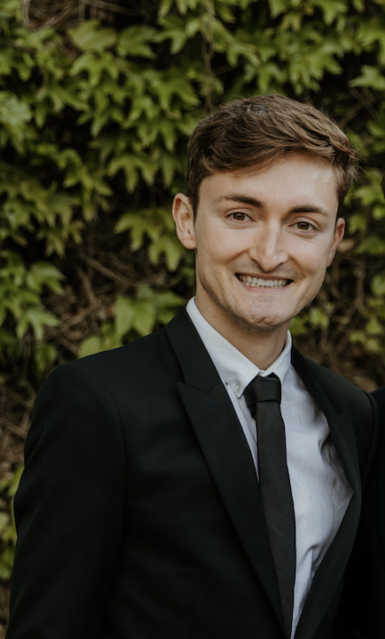

## Contact
robert.coatsworth@sorbonne-universite.fr

## Directrice de thèse
Sandrine Parageau

## Thèmes de recherche

- Ethnographie  
- Histoire des Amérindiens 
- XVIIIe–XIXe siècles 
- Récits de voyageuses 
- Autodidaxie 
- Empire britannique 
- Impérialisme écologique

## Titre de la thèse
"Les contributions ethnographiques d'Anne MacVicar Grant : observations sur la colonie de New York et les tribus amérindiennes au milieu du XVIIIe siècle"

## Lien(s) vers autres pages
https://theses.fr/s400270

