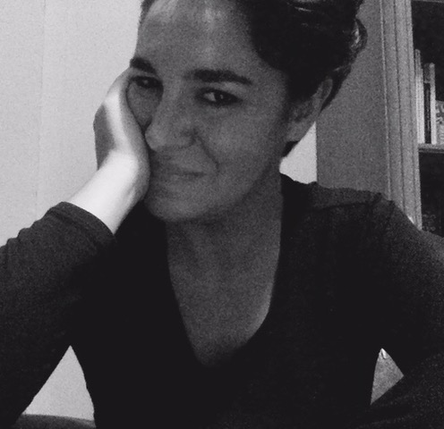

## Contact

 marion.marchet@gmail.com

## Thèmes de recherche

### Thématiques générales
Histoire nord-américaine ; histoire africaine-américaine ; histoire urbaine, politique et sociale ; XXe et XXIe siècles

### Thématiques particulières
Race et racisme ; néolibéralisme ; échelon local ; Midwest 

## Articles dans une revue

- « Le pari universaliste avant Black Lives Matter : candidatures et représentation africaines- américaines dans la banlieue blanche du Midwest (1981-2008) », dossier « Personnel politique local : trajectoires et pratiques de représentation », revue *Politique américaine*, printemps 2023.

- « Mobilité sociales et spatiales d'Africain·es-Américain·es vers la banlieue de « l'entre- deux » dans la deuxième moitié du 20ème siècle : le cas d'Euclid, Ohio », dossier « Entre- deux », revue *E-Rea*, 2022.

## Chapitre dans un ouvrage collectif

- Marion Marchet et Victoria Gonzalez Maltes, « Le vote par correspondance aux États-Unis, nouvelle fracture partisane à l'ère Trump et post-Trump » dans dir. Boidin-Caravias et al., *La pandémie de Covid-19 : Expériences américaines*, Aubervilliers, Éditions de l'IHEAL, Colectivo, n°1, mars 2022, pp. 236-252.

## Recensions

- Recension Charlotte Recoquillon, *Harlem, une histoire de la gentrification*, Paris, Éditions de la Maison des sciences de l'homme, 2024, compte-rendu, *Politiques Américaines*, n°43, 2025.

- Recension Olivier Maheo, *De Rosa Parks au Black Power: Une histoire populaire des mouvements noirs, 1945-1970*, Rennes, Presses universitaires de Rennes, 2024, compte-rendu, *Les Cahiers d'histoire. Revue d’histoire critique*, n° 161, 2024.

- Recension Olivier Richomme, *Race and Partisanship in California Redistricting, Lanham, Rowman & Littlefield*, 2019, *Revue Française d'Études Américaines*, vol. 163, n°2, 2020, pp. 127-34.

- « Citizen Brown, Race For Profit: Race et citoyenneté aux XXème et XXIème siècles », présentation d'ouvrages et compte-rendu de tables rondes de la Society of American City and Regional Planning History, Arlington (Virginie), 31 octobre-3 novembre 2019, *Transatlantica*, n°1, 2019.

## Interventions orales récentes

- « Du community organizing au consensus organizing : les mobilisations raciales consensuelles de l'ère néolibérale », mai 2024, 55ème Congrès de l'Association française d'études américaines (AFEA), Aix-Marseille Université, Aix-en-Provence.

- « Le pari universaliste avant Black Lives Matter », journée d'études « Personnel et représentation politiques : travailler sur les élu·e·s dans une perspective franco-américaine », avril 2022, Université d'Avignon.

- « Les espaces de la mobilité africaine-américaine à partir des années 1970 : Regard croisé sur la banlieue de Cleveland et d'Atlanta », mars 2021, séminaire HDEA, Sorbonne Université.

## Organisation d'événements et partenariats

- Co-organisatrice, atelier « From Selma to Ferguson: Reconfigurations of African- American Mobilizations Since the Civil Rights Movement », mai 2024, 55ème Congrès de l'Association française d'études américaines (AFEA), Aix-Marseille Université, Aix-en-Provence.

- Co-organisatrice, colloque international HDEA « Contours du bien-être et de la santé », mars 2023, Sorbonne Université, Paris. 

- Co-organisatrice de la journée d'étude AREA, « Rethinking The Rust Belt since 1945 », décembre 2018, HDEA et CREA, Université Paris Nanterre, Sorbonne Université, Paris.

## Autres / Divers

### Activités éditoriales

- Secrétaire de rédaction pour *Transatlantica*, septembre 2025-.
- Relectrice pour *Transatlantica*, septembre 2024 - septembre 2025.
  
### Distinctions et bourse de recherche
- Fulbright Visiting Research Student, Maxine Goodman Levin School of Urban Affairs, Cleveland State University, 2019-2020. 
- Prix IdA - Fulbright, 2019. 
- Lauréate bourse Georges Lurcy (déclinée), 2019.
  
### Jury
- Membre du jury du CAPES externe d’anglais, 2025-.
  
### Affiliations à des sociétés savantes

- Membre de l'Association française d’études américaines (AFEA), 2016-.
- Membre de la Society for American City and Regional Planning History (SACRPH), 2019-2020.

